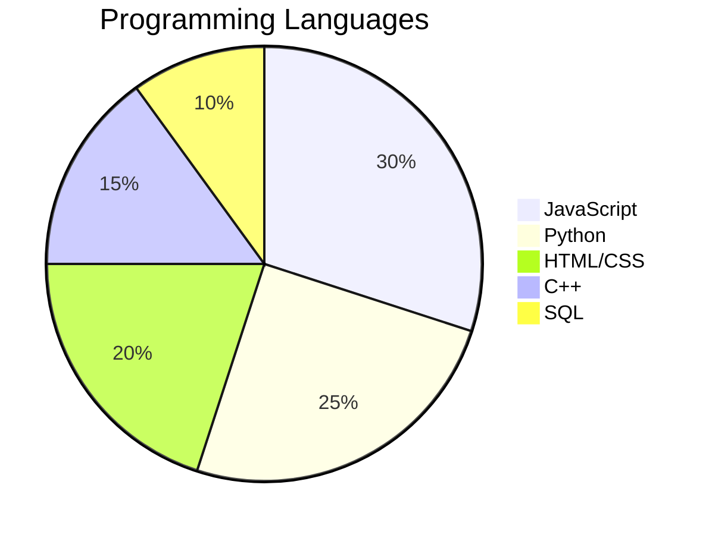
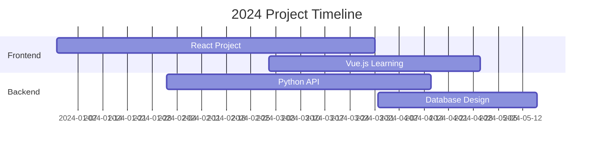

<div align="center">
  
</div>

# <div align="center">👋 Hello World, I'm Nethindu Hansaka!
```
【nethinduhansaka-dev】
```
</div>


<div align="center">
  <a href="mailto:nethinduhansaka6113@gmail.com">
    
  </a>
  <a href="https://linkedin.com/in/nethinduhansaka-a752072b4">
    
  </a>
  <a href="https://medium.com/@nethinduhansaka">
    
  </a>
</div>

<div align="center">
  
  
  
  
</div>

## 📊 Performance Dashboard

### 📊 Contribution Activity
[](https://github.com/ashutosh00710/github-readme-activity-graph)


### 📈 Contribution Metrics
<div align="center">
  
</div>

<div align="center">
  
  
  
</div>

## 🎯 Skills & Expertise

### 💻 Technical Proficiency


### 🌟 Skill Progress

<details>
<summary>Frontend Development</summary>
<br/>
<p align="left">
███████████████████░░░░░ 85%
</p>
</details>

<details>
<summary>Backend Development</summary>
<br/>
<p align="left">
██████████████░░░░░░░░░░ 70%
</p>
</details>

<details>
<summary>Database Management</summary>
<br/>
<p align="left">
███████████████░░░░░░░░░ 75%
</p>
</details>

<details>
<summary>UI/UX Design</summary>
<br/>
<p align="left">
████████████████░░░░░░░░ 80%
</p>
</details>

<details>
<summary>DevOps</summary>
<br/>
<p align="left">
████████████░░░░░░░░░░░░ 60%
</p>
</details>

## 🎓 About Me

I'm a passionate Software Engineering student at the Open University of Sri Lanka, dedicated to creating innovative solutions and continuous learning. With a strong foundation in web development and a growing expertise in multiple programming languages, I'm always excited to take on new challenges and contribute to meaningful projects.

### 📊 Weekly Development Breakdown
```text
JavaScript   9 hrs 45 mins   ███████████░░░░░░   45.25%
Python       5 hrs 30 mins   ██████░░░░░░░░░░░   25.50%
HTML/CSS     4 hrs 15 mins   ████░░░░░░░░░░░░░   19.75%
C++          2 hrs 05 mins   ██░░░░░░░░░░░░░░░    9.50%
```

## 🚀 Current Focus & Projects

### Project Timeline


---

### 🎯 2024 Goals Progress

<table>
  <tr>
    <td>Open Source Contributions</td>
    <td>
      
    </td>
  </tr>
  <tr>
    <td>Portfolio Projects</td>
    <td>
      
    </td>
  </tr>
  <tr>
    <td>Technical Blog Posts</td>
    <td>
      
    </td>
  </tr>
  <tr>
    <td>Certifications</td>
    <td>
      
    </td>
  </tr>
</table>

## 💻 Technical Skills

### Languages & Frameworks
```
Frontend     →  HTML5, CSS3, JavaScript, React.js, Vue.js
Backend      →  Python, C++
Database     →  MySQL
Tools        →  Git, Bootstrap
```


### Currently Exploring
- 🔍 Advanced JavaScript Frameworks
- 🌐 Full-stack Development
- 📊 Database Management Systems
- 🎨 UI/UX Design Principles

## 📈 GitHub Statistics

<div align="center">
  
  
</div>

<div align="center">
  
</div>

## 🤝 Let's Connect!

<div align="center">
  <p>I'm always open to interesting conversations and collaboration opportunities!</p>
  <a href="https://www.facebook.com/profile.php?id=100090717030773&mibextid=ZbWKwL">
    
  </a>
  <a href="http://www.youtube.com/@nethinduhansaka7209">
    
  </a>
  <a href="https://www.hackerrank.com/profile/nethinduhansaka1">
    
  </a>
</div>

## 💪 Support My Work

<div align="center">
  
  <p>Happy Coding! 👨‍💻</p>
</div>

<div align="center">
  <a href="https://www.buymeacoffee.com/nethinduhansaka">
    
  </a>
</div>
